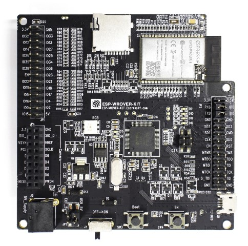

..
    Copyright 2019-2021 MicroEJ Corp. All rights reserved.
	This library is provided in source code for use, modification and test, subject to license terms.
	Any modification of the source code will break MicroEJ Corp. warranties on the whole library.

.. |BOARD_NAME| replace:: ESP-WROVER-KIT V4.1
.. |BOARD_REVISION| replace:: 4.1
.. |PLATFORM_VER| replace:: 1.7.1
.. |RCP| replace:: MICROEJ SDK
.. |PLATFORM| replace:: MicroEJ Platform
.. |PLATFORMS| replace:: MicroEJ Platforms
.. |SIM| replace:: MicroEJ Simulator
.. |ARCH| replace:: MicroEJ Architecture
.. |CIDE| replace:: MICROEJ SDK
.. |RTOS| replace:: FreeRTOS RTOS
.. |DEPLOYTOOL_NAME| replace:: Espressif Esptool
.. |MANUFACTURER| replace:: Espressif

.. _README MicroEJ BSP: ./ESP32-WROVER-Xtensa-FreeRTOS-bsp/Projects/microej/README.rst
.. _RELEASE NOTES: ./RELEASE_NOTES.rst
.. _CHANGELOG: ./CHANGELOG.rst

==========================================
|PLATFORM| for |MANUFACTURER| |BOARD_NAME|
==========================================

本项目用来为 |BOARD_NAME| 开发板 |PLATFORM| .

构建
使用以下命令克隆代码仓库： ``git clone --recursive https://github.com/MicroEJ/Platform-Espressif-ESP-WROVER-KIT-V4.1``.

相关文件
=============

本目录同时包含以下文件:

* `CHANGELOG`_ 用来跟踪MicroEJ |BOARD_NAME| 平台代码改动
* `RELEASE NOTES`_  会列出:

  - 支持的硬件平台,
  - 已知问题和限制,
  - 开发环境,
  - 依赖代码列表及版本.

* `README MicroEJ BSP`_ 建议用户熟悉 |MANUFACTURER| IDF 以及创建自定义构建过程等高级用法.

开发板技术规格
==============================

.. list-table::

   * - Name
     - |BOARD_NAME|
   * - Revision
     - |BOARD_REVISION|
   * - MCU part number
     - ESP32-WROVER-B
   * - MCU revision
     - N/A
   * - MCU architecture
     - Xtensa LX6
   * - MCU max clock frequency
     - 240 MHz
   * - Internal flash size
     - 540 KB
   * - Internal RAM size
     - 520 KB
   * - External flash size
     - 4 MB
   * - External RAM size
     - 8 MB 
   * - Power supply
     - USB, External 5V

下面是 |BOARD_NAME| 常用文档一览表链接:

- 开发板文档 Board documentation available `here <https://docs.espressif.com/projects/esp-idf/en/v3.3.4/hw-reference/modules-and-boards.html#esp-wrover-kit-v4-1>`__
- |MANUFACTURER| board Getting Started available `here <https://docs.espressif.com/projects/esp-idf/en/v3.3.4/get-started/get-started-wrover-kit.html>`__
- 开发板原理图 Board schematics available `here <https://dl.espressif.com/dl/schematics/ESP-WROVER-KIT_V4_1.pdf>`__
- 处理器参考设计 MCU Technical Reference Manual available `here <https://www.espressif.com/sites/default/files/documentation/esp32_technical_reference_manual_en.pdf>`__
- 处理器数据手册 MCU Datasheet available `here <https://espressif.com/sites/default/files/documentation/esp32_datasheet_en.pdf>`__
- 处理器勘误表 MCU Errata available `here <https://espressif.com/sites/default/files/documentation/eco_and_workarounds_for_bugs_in_esp32_en.pdf>`__

平台规格
=======================

Architecture 版本号 ``7.14.0``.

本平台提供下面的基础库:

.. list-table::
   :header-rows: 1

   * - Foundation Library
     - Version
   * - BLUETOOTH
     - 2.0
   * - BON
     - 1.4
   * - DEVICE
     - 1.1
   * - ECOM
     - 1.1
   * - ECOM-COMM
     - 1.1
   * - ECOM-NETWORK
     - 2.0
   * - ECOM-WIFI
     - 2.1
   * - EDC
     - 1.3
   * - ESP_IDF
     - 1.0
   * - FS
     - 2.0
   * - HAL
     - 1.0
   * - KF
     - 1.5
   * - MICROUI
     - 2.4
   * - NET
     - 1.1
   * - SECURITY
     - 1.3
   * - SNI
     - 1.4.0
   * - SSL
     - 2.2
   * - TRACE
     - 1.1

|PLATFORM| 可以导出为:

- Mono-Sandbox 平台 (默认)
- Multi-Sandbox 平台

需求列表
============

- Windows 10 或 Linux (Ubuntu LTS 20.04测试通过)
- 互联网可以连接到 `MicroEJ Central Repository <https://developer.microej.com/central-repository/>`_ 
- |RCP| 发行版 ``20.12`` 或者更高,  `下载 <https://developer.microej.com/get-started/>`_
- |BOARD_NAME| 开发板

BSP Setup 设置
==============

按照说明安装 |MANUFACTURER| 工具链 `here
<https://docs.espressif.com/projects/esp-idf/en/v3.3.4/get-started/index.html#setup-toolchain>`__.

Windows Toolchain 工具链
------------------------

- C/C++ toolchain name:
  esp32_win32_msys2_environment_and_toolchain_idf3-20200714
- C/C++ toolchain version: 20200714
- C/C++ toolchain download link:
  https://dl.espressif.com/dl/esp32_win32_msys2_environment_and_toolchain_idf3-20200714.zip

请参考 |MANUFACTURER| 文档 `here
<https://docs.espressif.com/projects/esp-idf/en/v3.3.4/get-started/windows-setup.html>`__
获得详细说明.

Linux Toolchain 工具链
----------------------

- C/C++ toolchain name: xtensa-esp32-elf-linux
- C/C++ toolchain version: 1.22.0-96-g2852398-5.2.0
- C/C++ toolchain download link for 64-bit Linux:
  https://dl.espressif.com/dl/xtensa-esp32-elf-linux64-1.22.0-96-g2852398-5.2.0.tar.gz
- C/C++ toolchain download link for 32-bit Linux:
  https://dl.espressif.com/dl/xtensa-esp32-elf-linux32-1.22.0-96-g2852398-5.2.0.tar.gz

请参考 |MANUFACTURER| 文档 `here
<https://docs.espressif.com/projects/esp-idf/en/v3.3.4/get-started/linux-setup.html>`__
获得详细说明.

BSP Compilation 编译
--------------------

平台提供了预编译的 Mono-Sandbox 应用.
生成MicroEJ固件, 需要编译整个BSP工程.

编译 ``ESP32-WROVER-Xtensa-FreeRTOS-bsp`` 工程, 打开
命令行终端 并输入下列命令:

**On Windows:**

.. code-block:: sh

      $ cd "xxx/ESP32-WROVER-Xtensa-FreeRTOS-bsp/Projects/microej/scripts"
      $ build.bat 

**On Linux / macOS:**

.. code-block:: sh

      $ cd "xxx/ESP32-WROVER-Xtensa-FreeRTOS-bsp/Projects/microej/scripts"
      $ build.sh 

BSP工程编译开始后， 请等待最终消息输出:

.. code-block::

      To flash all build output, run 'make flash' or:

编译脚本需要知道工具链的位置, 如果你安装在特殊位置, 请参考 `README MicroEJ BSP`_ 
获得定义工具链位置的方法.

请参考 |MANUFACTURER| 文档 `here
<https://docs.espressif.com/projects/esp-idf/en/v3.3.4/get-started/linux-setup.html>`__.

请参考 `README MicroEJ BSP`_ 获得定制编译脚本的方法.

Board Setup 开发板设置
======================

请参考 |MANUFACTURER| 文档 `here
<https://docs.espressif.com/projects/esp-idf/en/v3.3.4/get-started/get-started-wrover-kit.html>`__
获得更多信息.

Power Supply 供电
-----------------

开发板可以用USB或者外接5V供电.

请参考 Espressif 文档 `here
<https://docs.espressif.com/projects/esp-idf/en/v3.3.4/get-started/get-started-wrover-kit.html>`__
获得更多信息.

Programming 烧写
--------------------

 |BOARD_NAME| 开发板可以使用 |MANUFACTURER| bootloader 烧写. 
 请按下列步骤操作:

- 将开发板通过USB接口连接到计算机
- 找到新出现的COM口
- 编辑
  ``ESP32-WROVER-Xtensa-FreeRTOS-bsp-bsp/Projects/microej/scripts/run.xxx``
  脚本 (Windows ``xxx`` 是 ``bat`` for Windows, Linux /
  macOS 是 ``sh`` ). 将 ``ESPPORT`` 变量更新成上一部新出现的COM口, 如果已经存在
  请取消相应行的注释符号.
- 打开命令行终端输入下面的命令:

**On Windows:**

.. code-block:: sh

      $ cd "xxx/ESP32-WROVER-Xtensa-FreeRTOS-bsp/Projects/microej/scripts"
      $ run.bat 

**On Linux / macOS:**

.. code-block:: sh

      $ cd "xxx/ESP32-WROVER-Xtensa-FreeRTOS-bsp/Projects/microej/scripts"
      $ run.sh 

固件烧写开始后，请等待下面的消息:

.. code-block::

      Leaving...
      Hard resetting...

|MANUFACTURER| 编译和烧写参考文档 `here
<https://docs.espressif.com/projects/esp-idf/en/v3.3.4/get-started/index.html#build-and-flash>`__

Logs Output 日志输出
--------------------

MicroEJ 平台使用 |BOARD_NAME| USB 虚拟 UART. 在使用USB连接开发板到计算
机时, 会自动加载一个COM口. 开发板所有的日志都通过这个COM口输出.

COM口使用下面的参数:

.. list-table::
   :widths: 3 2

   * - Baudrate
     - 115200
   * - Data bits bits
     - 8
   * - Parity bits
     - None
   * - Stop bits
     - 1
   * - Flow control
     - None

烧写后，预编译的应用会从UART口输出 ``Hello World`` .

如果运行测试集，日志必须重定向到另一个串口. 具体请参考 `Testsuite Configuration`_ 
里的详细解释说明.

请参考 |MANUFACTURER| 文档 `here
<https://docs.espressif.com/projects/esp-idf/en/v3.3.4/get-started/establish-serial-connection.html>`__
获得更多信息.

Debugging 调试
--------------

通过USB接口实现JTAG调试.

请参考 `README MicroEJ BSP`_ 章节获取更多详细信息.

Platform Setup 平台配置
=======================

Platform Import 平台导入
------------------------

在 |RCP| Workspace 里导入工程:

- ``File`` > ``Import`` > ``Existing Projects into Workspace`` >
  ``Next``
- ``Select root directory`` 选择克隆好的工程.
- 点击 ``Finish``

在 |RCP| 里可以看到, 选择的示例被导入为几个以给定名称为前缀的工程:

- ``ESP32-WROVER-Xtensa-FreeRTOS-configuration``: 包含平台配置说明.
  一些模块的配置文件放在指定的子目录下/或者使用配置文件
  (``.properties`` and / or ``.xml``).

- ``ESP32-WROVER-Xtensa-FreeRTOS-bsp``: 包含 |BOARD_NAME| 开发板上已经
  测试通过的BSP软件工程文件, 一个 |CIDE| 工程, 一个移植好在 |RTOS| 上的
  MicroEJ 核心(包括扩展模块) 和 |BOARD_NAME| 开发板的支持包.

- ``ESP32-WROVER-Xtensa-FreeRTOS-fp``: 包含用于 |SIM| 的开发板配置. 
  这个工程在每次MicroEJ 平台重新生成的时候更新.

- ``ESP32WROVER-Platform-GNUv52b96_xtensa-esp32-psram-{version}``:
  MicroEJ平台重新生成后，这个目录会产生 |RCP| 平台工程文件.

默认情况, MicroEJ平台配置为 Mono-Sandbox 评估模式. 如果需要配置使用
Multi-Sandbox, 需要使用 ``build_no_ota_no_systemview`` 脚本 (请参考 `RELEASE
NOTES`_ 限制于依赖章节获取更多信息).

Platform Build 平台构建
-----------------------

要生成MicroEJ运行平台, 请按下列步骤执行:

- 在 |RCP| 里右键点击 ``ESP32-WROVER-Xtensa-FreeRTOS-configuration``.
- 点击 ``Build Module``

生成过程随后开始. 这个过程将会持续几分钟.  首先，会从MicroEJ Central 
Repository下载相关模块. 你可以在MicroEJ console里看到生成过程的日志.

请等待最终完成消息:

.. code-block::

                          BUILD SUCCESSFUL

最终 |BOARD_NAME| 开发板的 |PLATFORM| 会全部生成并且链接到 |CIDE|
工程.

|RCP| 里的 ``ESP32WROVER-Platform-GNUv52b96_xtensa-esp32-psram-{version}``
平台工程不应该有任何报错.

请参考
https://docs.microej.com/en/latest/ApplicationDeveloperGuide/standaloneApplication.html
获取如何生成MicroEJ Standalone应用的更多信息.

Testsuite Configuration 测试项配置
==================================

在 |BOARD_NAME| 开发板上运行测试项 需要将标准输出重新定向到专用的UART上.
``config.properties`` 里的``microej.testsuite.properties.debug.traces.uart``
属性必须被设置.

这个属性重定向UART到不同的GPIO端口. 将一个FTDI USB线连接到JP4的D0和接地。

.. image:: ./images/testsuite_plug_uart_wrover.JPG

在 ``config.properties`` 文件里, 属性 ``target.platform.dir`` 必须设置成绝对路径.
比如
``C:/Platform-Espressif-ESP-WROVER-KIT-V4.1/ESP32-WROVER-Xtensa-FreeRTOS-platform/source``.

Testsuite FS 测试集 FS
----------------------

在目录 ``ESP32-WROVER-Xtensa-FreeRTOS-configuration/testsuites/fs/``里提供了
``config.properties`` 和 ``microej-testsuite-common.properties``.

Troubleshooting 故障排除
=========================

esp-idf/make/project.mk: No such file or directory
--------------------------------------------------

.. code-block::

   Makefile:11: Platform-Espressif-ESP-WROVER-KIT-V4.1/ESP32-WROVER-Xtensa-FreeRTOS-bsp/Projects/microej/../../Drivers/esp-idf/make/project.mk: No such file or directory
   make: *** No rule to make target 'Platform-Espressif-ESP-WROVER-KIT-V4.1/ESP32-WROVER-Xtensa-FreeRTOS-bsp/Projects/microej/../../Drivers/esp-idf/make/project.mk'.  Stop.
   cp: cannot stat 'build/microej.elf': No such file or directory

确保克隆代码仓库时包含所有子模块. 用下面的命令同步所有模块:

.. code-block:: sh

   git submodule update --init --recursive

Unable to flash on Linux through VirtualBox
-------------------------------------------

Press the "boot" button on the board while flashing.

Files not found during the build
--------------------------------

找不到文件可能是源于路径过长. 请参考 `RELEASE NOTES`_ 里的已知问题和限制来寻求应对方法.
