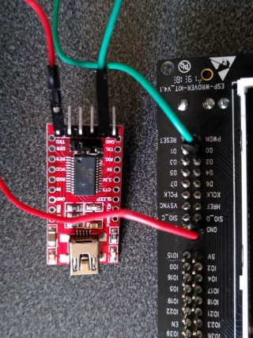

..
    Copyright 2019-2023 MicroEJ Corp. All rights reserved.
    Use of this source code is governed by a BSD-style license that can be found with this software.

.. |BOARD_NAME| replace:: ESP-WROVER-KIT V4.1
.. |BOARD_REVISION| replace:: 4.1
.. |PLATFORM_VER| replace:: 2.2.0
.. |RCP| replace:: MICROEJ SDK
.. |PLATFORM| replace:: MicroEJ Platform
.. |PLATFORMS| replace:: MicroEJ Platforms
.. |SIM| replace:: MicroEJ Simulator
.. |ARCH| replace:: MicroEJ Architecture
.. |CIDE| replace:: MICROEJ SDK
.. |RTOS| replace:: FreeRTOS RTOS
.. |DEPLOYTOOL_NAME| replace:: Espressif Esptool
.. |MANUFACTURER| replace:: Espressif

.. _README MicroEJ BSP: ./../../ESP32-WROVER-Xtensa-FreeRTOS-bsp/projects/microej/docs/zn_CH/README.rst
.. _RELEASE NOTES: ./../../RELEASE_NOTES.rst
.. _CHANGELOG: ./../../CHANGELOG.rst

==========================================
|PLATFORM| for |MANUFACTURER| |BOARD_NAME|
==========================================

本项目用来为 |BOARD_NAME| 开发板构建 |PLATFORM| .

.. image:: ../../images/esp-wrover-kit-v4.1-front.jpg

使用以下命令克隆代码仓库： 

.. code-block:: sh

   git clone --recursive https://github.com/MicroEJ/Platform-Espressif-ESP-WROVER-KIT-V4.1

务必添加 ``--recursive`` 选项. 如果您已经克隆了此代码仓库，但没有上面的选项，请运行另一个命令以获取所有子模块：

.. code-block:: sh

   git submodule update --init --recursive

相关文件
=============

本目录同时包含以下文件:

* `CHANGELOG`_ 用来跟踪MicroEJ |BOARD_NAME| 平台代码改动
* `RELEASE NOTES`_  会列出:

  - 支持的硬件,
  - 已知问题和限制,
  - 开发环境,
  - 依赖代码列表及版本.

* `README MicroEJ BSP`_ 建议用户熟悉 |MANUFACTURER| IDF 以及创建自定义构建过程等高级用法。

开发板技术规格
==============================

.. list-table::

   * - Name
     - |BOARD_NAME|
   * - Revision
     - |BOARD_REVISION|
   * - MCU part number
     - ESP32-WROVER-B
   * - MCU revision
     - N/A
   * - MCU architecture
     - Xtensa LX6
   * - MCU max clock frequency
     - 240 MHz
   * - Internal flash size
     - 540 KB
   * - Internal RAM size
     - 520 KB
   * - External flash size
     - 4 MB
   * - External RAM size
     - 8 MB 
   * - Power supply
     - USB, External 5V

下面是 |BOARD_NAME| 常用文档一览表链接:

- 开发板文档 `here <https://docs.espressif.com/projects/esp-idf/en/v4.3.2/hw-reference/modules-and-boards.html#esp-wrover-kit-v4-1>`__
- |MANUFACTURER| 开发版入门指南 `here <https://docs.espressif.com/projects/esp-idf/en/v4.3.2/get-started/get-started-wrover-kit.html>`__
- 开发板原理图 `here <https://dl.espressif.com/dl/schematics/ESP-WROVER-KIT_V4_1.pdf>`__
- 处理器技术参考手册 `here <https://www.espressif.com/sites/default/files/documentation/esp32_technical_reference_manual_en.pdf>`__
- 处理器数据手册 `here <https://espressif.com/sites/default/files/documentation/esp32_datasheet_en.pdf>`__
- 处理器勘误表 `here <https://espressif.com/sites/default/files/documentation/eco_and_workarounds_for_bugs_in_esp32_en.pdf>`__

平台规格
=======================

Architecture 版本号 ``7.20.1``.

本平台提供下面的基础库:

.. list-table::
   :header-rows: 1

   * - Foundation Library
     - Version
   * - BLUETOOTH
     - 2.1
   * - BON
     - 1.4
   * - DEVICE
     - 1.1
   * - DRAWING
     - 1.0  
   * - ECOM-NETWORK
     - 2.1
   * - ECOM-WIFI
     - 2.3
   * - ESP_IDF
     - 1.1
   * - FS
     - 2.1
   * - HAL
     - 1.0
   * - KF
     - 1.6
   * - MICROUI
     - 3.1
   * - NET
     - 1.1
   * - NLS
     - 2.0 
   * - SECURITY
     - 1.4
   * - SNI
     - 1.4
   * - SSL
     - 2.2
   * - TRACE
     - 1.1
   * - WATCHDOG
     - 1.0 

|PLATFORM| 可以分为:

- Mono-Sandbox 平台 (默认)
- Multi-Sandbox 平台

需求列表
============

- Windows 10 或 Linux (Ubuntu LTS 20.04测试通过)
- 互联网可以连接到 `MicroEJ Central Repository <https://developer.microej.com/central-repository/>`_ 
- |RCP| 发行版 ``21.11`` 或者更高,  `下载 <https://developer.microej.com/get-started/>`_
- |BOARD_NAME| 开发板

BSP Setup 设置
==============

按照说明安装 |MANUFACTURER| 工具链 `here
<https://docs.espressif.com/projects/esp-idf/en/v4.3.2/get-started/index.html#setup-toolchain>`__.

请注意上述文档中描述的安装路径的限制（例如，不能有空格、括号...）。

请参考 |MANUFACTURER| 文档 `here <https://docs.espressif.com/projects/esp-idf/en/v4.3.2/esp32/api-guides/tools/idf-tools.html#list-of-idf-tools>`__ 
获得关于 |MANUFACTURER| 工具更详细的介绍。

Windows Toolchain 工具链
------------------------
- C/C++ 工具链: xtensa-esp32-elf-gcc
- C/C++ 工具链版本: 8.4.0 (crosstool-NG esp-2021r2)
- C/C++ 工具链下载链接 64-bit Windows: https://github.com/espressif/crosstool-NG/releases/download/esp-2021r2/xtensa-esp32-elf-gcc8_4_0-esp-2021r2-patch1-win64.zip
- C/C++ 工具链下载链接 32-bit Windows: https://github.com/espressif/crosstool-NG/releases/download/esp-2021r2/xtensa-esp32-elf-gcc8_4_0-esp-2021r2-patch1-win32.zip

请参考 |MANUFACTURER| 文档 `here
<https://docs.espressif.com/projects/esp-idf/en/v4.3.2/get-started/windows-setup.html>`__
获得详细说明。

Linux Toolchain 工具链
----------------------
- C/C++ 工具链: xtensa-esp32-elf-gcc
- C/C++ 工具链版本: 8.4.0 (crosstool-NG esp-2021r2)
- C/C++ 工具链下载链接 64-bit Linux: https://github.com/espressif/crosstool-NG/releases/download/esp-2021r2/xtensa-esp32-elf-gcc8_4_0-esp-2021r2-linux-amd64.tar.gz
- C/C++ 工具链下载链接 32-bit Linux: https://github.com/espressif/crosstool-NG/releases/download/esp-2021r2/xtensa-esp32-elf-gcc8_4_0-esp-2021r2-linux-i686.tar.gz

请参考 |MANUFACTURER| 文档 `here
<https://docs.espressif.com/projects/esp-idf/en/v4.3.2/get-started/linux-setup.html>`__
获得详细说明。

BSP Compilation 编译
--------------------
在第一次构建 BSP 之前，确保您已经克隆了代码仓库及其所有子模块，并打上 MicroEJ Segger SystemView 补丁。 
以上要求这可以通过运行 ``xxx/ESP32-WROVER-Xtensa-FreeRTOS-bsp/projects/microej/scripts`` 中的脚本 **RunAtFirstBSPCompile**实现。
有关详细信息，请参阅 `README MicroEJ BSP`_。

平台提供了预编译的 Mono-Sandbox 应用. 通过编译BSP工程，可以验证BSP安装，并且构建MicroEJ固件。

若要编译 ``ESP32-WROVER-Xtensa-FreeRTOS-bsp`` 工程, 打开
命令行终端 并输入下列命令:

**On Windows:**

.. code-block:: sh

      $ cd "xxx/ESP32-WROVER-Xtensa-FreeRTOS-bsp/projects/microej/scripts"
      $ build.bat 

**On Linux / macOS:**

.. code-block:: sh

      $ cd "xxx/ESP32-WROVER-Xtensa-FreeRTOS-bsp/projects/microej/scripts"
      $ build.sh 

BSP工程编译开始后， 请等待最终消息输出:

.. code-block::

      To flash all build output, run 'make flash' or:

如果要自定义编译脚本,请参考 `README MicroEJ BSP`_ 

Board Setup 开发板设置
======================

请参考 |MANUFACTURER| 文档 `here
<https://docs.espressif.com/projects/esp-idf/en/v4.3.2/get-started/get-started-wrover-kit.html>`__
获得更多信息.

Power Supply 供电
-----------------

开发板可以用USB或者外接5V供电.

请参考 Espressif 文档 `here
<https://docs.espressif.com/projects/esp-idf/en/v4.3.2/get-started/get-started-wrover-kit.html>`__
获得更多信息.

Programming 烧写
--------------------

 |BOARD_NAME| 开发板可以使用 |MANUFACTURER| bootloader 烧写. 
 请按下列步骤操作:

- 将开发板通过USB接口连接到计算机
- 找到新出现的COM口
- 编辑
  ``ESP32-WROVER-Xtensa-FreeRTOS-bsp-bsp/projects/microej/scripts/run.xxx``
  脚本 (Windows ``xxx`` 是 ``bat``, Linux /
  macOS 是 ``sh`` ). 将 ``ESPPORT`` 变量更新成上一步新出现的COM口。
- 打开命令行终端输入下面的命令:

**On Windows:**

.. code-block:: sh

      $ cd "xxx/ESP32-WROVER-Xtensa-FreeRTOS-bsp/projects/microej/scripts"
      $ run.bat 

**On Linux / macOS:**

.. code-block:: sh

      $ cd "xxx/ESP32-WROVER-Xtensa-FreeRTOS-bsp/projects/microej/scripts"
      $ run.sh 

固件烧写开始后，请等待下面的消息:

.. code-block::

      Leaving...
      Hard resetting...

|MANUFACTURER| 编译和烧写也可参考文档 `here
<https://docs.espressif.com/projects/esp-idf/en/v4.3.2/get-started/index.html#build-and-flash>`__

Logs Output 日志输出
--------------------

MicroEJ 平台使用 |BOARD_NAME| USB 虚拟 UART. 在使用USB连接开发板到计算
机时, 会自动加载一个COM口. 开发板所有的日志都通过这个COM口输出.

COM口使用下面的参数:

.. list-table::
   :widths: 3 2

   * - Baudrate
     - 115200
   * - Data bits bits
     - 8
   * - Parity bits
     - None
   * - Stop bits
     - 1
   * - Flow control
     - None

烧写后，预编译的应用会从UART口输出 ``Hello World`` .

如果运行测试集，日志必须重定向到另一个串口. 具体请参考 `Testsuite Configuration`_ 
里的详细解释说明.

请参考 |MANUFACTURER| 文档 `here
<https://docs.espressif.com/projects/esp-idf/en/v4.3.2/get-started/establish-serial-connection.html>`__
获得更多信息.

Debugging 调试
--------------

通过USB接口实现JTAG调试.

请参考 `README MicroEJ BSP`_ 章节获取更多详细信息.

Platform Setup 平台配置
=======================

Platform Import 平台导入
------------------------

在 |RCP| Workspace 里导入工程:

- ``File`` > ``Import`` > ``Existing Projects into Workspace`` >
  ``Next``
- ``Select root directory`` 选择克隆好的工程。
- 点击 ``Finish``

在 |RCP| 里可以看到, 选择的示例被导入为几个以给定名称为前缀的工程:

- ``ESP32-WROVER-Xtensa-FreeRTOS-configuration``: 包含平台配置说明，
  一些模块的配置文件放在指定的子目录下/或者使用配置文件
  (``.properties`` and / or ``.xml``)。

- ``ESP32-WROVER-Xtensa-FreeRTOS-bsp``: 包含 |BOARD_NAME| 开发板上已经
  测试通过的BSP软件工程文件, 一个 |CIDE| 工程, 一个移植好在 |RTOS| 上的
  MicroEJ 核心(包括扩展模块) 和 |BOARD_NAME| 开发板的支持包。

- ``ESP32-WROVER-Xtensa-FreeRTOS-fp``: 包含用于 |SIM| 的开发板配置。
  这个工程在每次 MicroEJ 平台重新生成的时候更新。

- ``ESP32WROVER-Platform-GNUv84_xtensa-esp32-psram-{version}``:
  MicroEJ平台重新生成后，这个目录会产生 |RCP| 平台工程文件。

默认情况, MicroEJ平台配置为 Mono-Sandbox 评估模式。如果需要配置使用
Multi-Sandbox, 需要使用 ``build_no_ota_no_systemview`` 脚本 (请参考 `RELEASE
NOTES`_ 限制依赖章节获取更多信息)。

Platform Build 平台构建
-----------------------

要生成MicroEJ平台, 请按下列步骤执行:

- 在 |RCP| 里右键点击 ``ESP32-WROVER-Xtensa-FreeRTOS-configuration``.
- 点击 ``Build Module``

生成过程随后开始。 这个过程将会持续几分钟。首先，会从MicroEJ Central 
Repository下载相关模块。你可以在MicroEJ console里看到生成过程的日志。

请等待最终完成消息:

.. code-block::

                          BUILD SUCCESSFUL

最终 |BOARD_NAME| 开发板的 |PLATFORM| 会全部生成并且链接到 |CIDE|
工程.

|RCP| 里的 ``ESP32WROVER-Platform-GNUv84_xtensa-esp32-psram-{version}``
平台工程不应该有任何报错.

请参考
https://docs.microej.com/en/latest/ApplicationDeveloperGuide/standaloneApplication.html
获取更多如何生成MicroEJ Standalone应用的信息.

Testsuite Configuration 测试项配置
==================================

在 |BOARD_NAME| 开发板上运行测试项 需要将标准输出重新定向到专用的UART上.
``config.properties`` 里的 ``microej.testsuite.properties.debug.traces.uart``
属性必须被设置.

这个属性重定向UART到不同的GPIO端口. 将一个FTDI USB线连接到JP4的D0和接地。

在 ``config.properties`` 文件里, 属性 ``target.platform.dir`` 必须设置成绝对路径.
比如
``C:/Platform-Espressif-ESP-WROVER-KIT-V4.1/ESP32-WROVER-Xtensa-FreeRTOS-platform/source``.

Testsuite FS 测试集 FS
----------------------

在目录 ``ESP32-WROVER-Xtensa-FreeRTOS-configuration/testsuites/fs/``里提供了
``config.properties`` 和 ``microej-testsuite-common.properties``.

Troubleshooting 故障排除
=========================

esp-idf/make/project.mk: No such file or directory
--------------------------------------------------

.. code-block::

   Makefile:11: Platform-Espressif-ESP-WROVER-KIT-V4.1/ESP32-WROVER-Xtensa-FreeRTOS-bsp/projects/microej/../../Drivers/esp-idf/make/project.mk: No such file or directory
   make: *** No rule to make target 'Platform-Espressif-ESP-WROVER-KIT-V4.1/ESP32-WROVER-Xtensa-FreeRTOS-bsp/projects/microej/../../Drivers/esp-idf/make/project.mk'.  Stop.
   cp: cannot stat 'build/microej.elf': No such file or directory

确保克隆代码仓库时包含所有子模块. 用下面的命令同步所有模块:

.. code-block:: sh

   git submodule update --init --recursive

Unable to flash on Linux through VirtualBox
-------------------------------------------

Press the "boot" button on the board while flashing.

Files not found during the build
--------------------------------

找不到文件可能是源于路径过长. 请参考 `RELEASE NOTES`_ 里的已知问题和限制章节来寻求应对方法.
